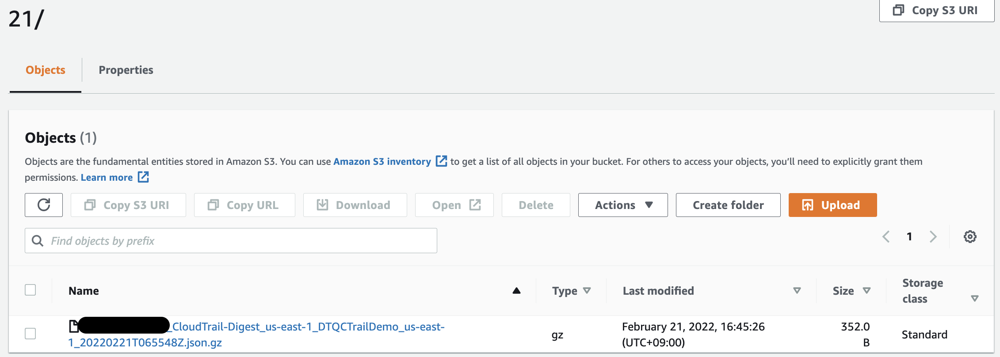

# aws-ctrail-s3-cwatch-demo 🐳


[](https://github.com/tquangdo/aws-ctrail-s3-cwatch-demo/issues/new)

## reference
[docsamazon](https://docs.aws.amazon.com/awscloudtrail/latest/userguide/cloudtrail-getting-started.html)

## AWS CloudTrail
1. ### BEFORE CREATE
  - can see info in `Event history` (NOT in `Trails`)
  > screenshot info: `DeleteLogGroup`
  
1. ### CREATE
  - choose S3 & CWatch
  
  - after created
  

## AWS S3
- access into `AWSLogs/<AWS_ACCID!!!>/CloudTrail/us-east-1/2022/02/21/` & download json file

> NOTE :
> 1. Luôn có độ trễ giữa sự kiện (events) xảy ra so với hiển thị trên bảng điều khiển CloudTrail
> 2. Được gửi cứ sau 5 phút (hoạt động) vs với độ trễ tối đa 15 phút

## AWS CloudWatch
> screenshot info: `DeleteLogGroup` => `/aws/codebuild`


## AWS CLI
1. ### list
  ```shell
  aws cloudtrail describe-trails
  =>
  {
      "trailList": [
          {
              "Name": "DTQCTrailDemo",
              "S3BucketName": "aws-dtq-cloudtrail-logs-<AWS_ACCID!!!>-e5c21b44",
              "IncludeGlobalServiceEvents": true,
              "IsMultiRegionTrail": true,
              "HomeRegion": "us-east-1",
              "TrailARN": ...
          }
      ]
  }
  ```
1. ### validate logs
  ```shell
  aws cloudtrail validate-logs --trail-arn arn:aws:cloudtrail:us-east-1:<AWS_ACCID!!!>:trail/DTQCTrailDemo --start-time 2022-02-21T06:09:00Z --verbose
  =>
  Validating log files for trail arn:aws:cloudtrail:us-east-1:<AWS_ACCID!!!>:trail/DTQCTrailDemo between 2022-02-21T06:09:00Z and 2022-02-21T07:51:54Z
  Digest file     s3://aws-dtq-cloudtrail-logs-<AWS_ACCID!!!>-e5c21b44/AWSLogs/<AWS_ACCID!!!>/CloudTrail-Digest/us-east-1/2022/02/21/<AWS_ACCID!!!>_CloudTrail-Digest_us-east-1_DTQCTrailDemo_us-east-1_20220221T065548Z.json.gz        valid
  1/1 digest files valid
  ```
  - same with result in s3: `AWSLogs/<AWS_ACCID!!!>/CloudTrail-Digest/us-east-1/2022/02/21/`
  
1. ### start logging (after deleted trail by AWS CLI)
  ```shell
  aws cloudtrail create-trail --name DTQCTrailDemo --s3-bucket-name <BUCKET MUST EXIST!!!> --is-multi-region-trail --enable-log-file-validation
  =>     
  {
      "Name": "DTQCTrailDemo",
      "S3BucketName": ...
  }
  aws cloudtrail start-logging --name DTQCTrailDemo
  aws cloudtrail get-trail-status --name DTQCTrailDemo
  =>     
  {
      "IsLogging": true,
      "StartLoggingTime": "2022-02-21T17:12:30.511000+09:00",
      "LatestDeliveryAttemptTime": "",
      "LatestNotificationAttemptTime": "",
      "LatestNotificationAttemptSucceeded": "",
      "LatestDeliveryAttemptSucceeded": "",
      "TimeLoggingStarted": "2022-02-21T08:12:30Z",
      "TimeLoggingStopped": ""
  }
  ```
1. ### stop logging (after created trail by AWS console)
  ```shell
  aws cloudtrail get-trail-status --name DTQCTrailDemo
  =>     
  {
      "IsLogging": true,
      "LatestDeliveryTime": "2022-02-21T16:56:00.818000+09:00",
      "StartLoggingTime": "2022-02-21T15:55:48.373000+09:00",
      "LatestCloudWatchLogsDeliveryTime": "2022-02-21T16:57:40.916000+09:00",
      "LatestDigestDeliveryTime": "2022-02-21T16:45:24.875000+09:00",
      "LatestDeliveryAttemptTime": "2022-02-21T07:56:00Z",
      ...
  }
  aws cloudtrail stop-logging --name DTQCTrailDemo
  aws cloudtrail get-trail-status --name DTQCTrailDemo
  =>     
  {
      "IsLogging": false,
      "LatestDeliveryTime": "2022-02-21T16:56:00.818000+09:00",
      "StartLoggingTime": "2022-02-21T15:55:48.373000+09:00",
      "StopLoggingTime": "2022-02-21T16:59:24.934000+09:00",
      "LatestCloudWatchLogsDeliveryTime": "2022-02-21T16:57:40.916000+09:00",
      "LatestDigestDeliveryTime": "2022-02-21T16:45:24.875000+09:00",
      "LatestDeliveryAttemptTime": "2022-02-21T07:56:00Z",
      ...
  }
  ```

## delete AWS resources
`./del_aws_resource.sh`

## terraform
```shell
terraform$ terraform init && terraform apply -auto-approve
=> Apply complete! Resources: 3 added, 0 changed, 0 destroyed.
terraform destroy -auto-approve
=> Plan: 0 to add, 0 to change, 3 to destroy.
```
